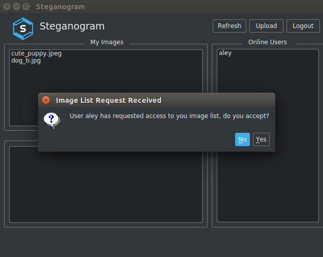

# Steganogram
Image sharing application built using UNIX sockets and UDP to implement Remote Invocation Middleware (RMI) and grant its users capabilties to control their images' sharing privileges.



For class diagrams and detailed documentation, [click here](./documentation.pdf).

### Contributors (Group D)
- Aley Baracat
- Sara Seleem
- John Sourour
- Yasmin ElDokany

### Dependencies to be installed:
- [Steghide](http://steghide.sourceforge.net/)
```
sudo apt-get install steghide
```

### To compile:
```
g++ -std=c++11 -pthread -Wno-write-strings Peer.h Peer.cpp Message.h Message.cpp AckData.h AckData.cpp AuthData.h AuthData.cpp ImageListData.h ImageListData.cpp StatusData.h StatusData.cpp PingData.h PingData.cpp ImageRequestData.h ImageRequestData.cpp ImageData.h ImageData.cpp Data.h Data.cpp UDPSocket.h UDPSocket.cpp main_service.cpp PackGen.h PackGen.cpp Service.cpp -o o
```

##### This project is supervised by Prof. Amr El-Kadi under the CSCE 445/4411 course.
